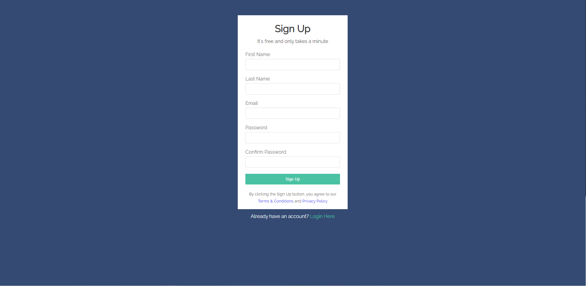

# Create a Functioning Signup Form
Style this form to look like the screenshot and set it up to send emails EmailJS!
Follow the instructions in the JavaScript file.

You will need to add a new Email Service (usually set to Gmail) and create a template for your email message.

[EmailJS](https://emailjs.com)

